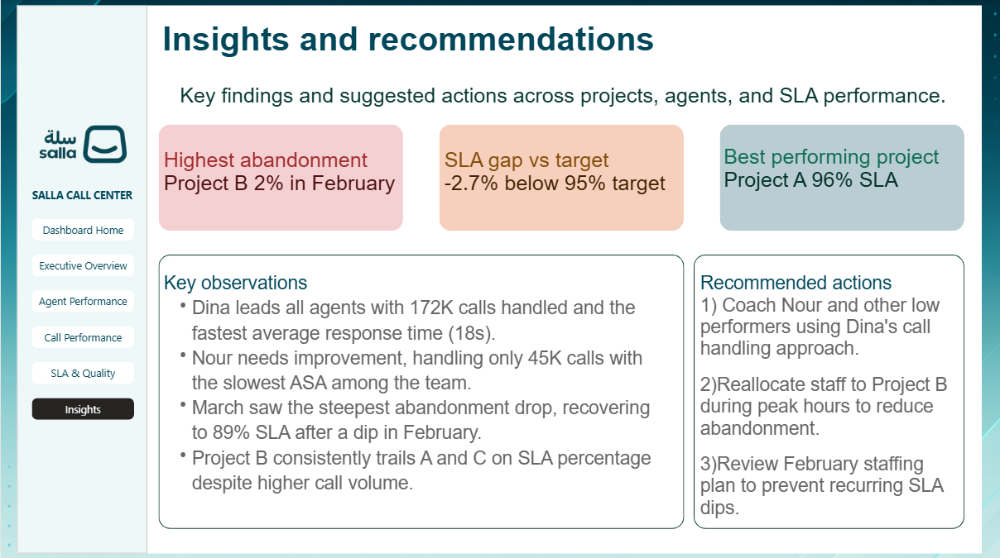

# 📞 Salla Call Center Performance Dashboard — Power BI

*An interactive Power BI dashboard analyzing Salla Call Center performance, focusing on operational efficiency, agent productivity, call metrics, SLA compliance, and business insights.*

---

## 🚀 Project Overview

This project analyzes **Salla Call Center** operations using **Power BI**. The dashboard transforms raw call center data into executive-level insights, helping stakeholders monitor agent performance, service quality, and operational efficiency.

| Detail  | Info                                                                                 |
| ------- | ------------------------------------------------------------------------------------ |
| Tool    | Power BI Desktop                                                                     |
| Dataset | Salla Call Center Dataset                                                            |
| Pages   | Executive Overview · Agent Performance · Call Performance · SLA & Quality · Insights |
| Focus   | Agent Productivity, Call Metrics, SLA, Service Quality, Business Performance         |

---

## 🖼 Dashboard Screenshots

### Executive Overview

Executive summary of the most important KPIs, including total calls, SLA performance, abandonment rate, average response time, and operational efficiency.

---

### Agent Performance

Analyze agent productivity, total handled calls, response time, and individual performance comparison.

---

### Call Performance

Monitor call volume trends, answered vs. abandoned calls, and monthly operational performance.

---

### SLA & Quality

Track SLA compliance, abandonment rate, response time, and identify performance gaps against service targets.

---

### Business Insights

Executive recommendations supported by key findings extracted from the dashboard.

---

## 💡 Key Insights

* 👩 **Dina** achieved the highest performance, handling **172K calls** with the fastest average response time (**18 seconds**).
* 📉 **Nour** handled only **45K calls** and recorded the slowest Average Speed of Answer (ASA), highlighting an opportunity for coaching.
* 📆 **March** showed the strongest operational recovery after February, reaching **89% SLA** following a temporary decline.
* ⚠️ **Project B** consistently underperformed in SLA despite handling a higher call volume than other projects.
* 🚨 Highest abandonment rate occurred in **Project B (2%) during February**.
* 📊 Overall SLA performance remained **2.7% below the 95% target**.
* 🏆 **Project A** delivered the best service quality, achieving **96% SLA**.

---

## 🎯 Business Recommendations

1. Coach **Nour** and other lower-performing agents using **Dina's** call-handling practices as a benchmark.
2. Reallocate additional agents to **Project B** during peak hours to reduce abandonment and improve SLA.
3. Review the staffing strategy used in **February** to prevent future SLA drops.
4. Continue monitoring response time and abandonment trends through monthly performance reviews.

---

## 🛠 Tools & Techniques

* **Power BI Desktop**
* **Power Query** — Data Cleaning & Transformation
* **DAX** — KPI Calculations & Performance Measures
* **Interactive Filters (Slicers)**
* **Cards, Line Charts, Bar Charts, Donut Charts, KPI Cards, Matrix Tables**

---

## 📁 Files in This Repo

| File                     | Description                                              |
| ------------------------ | -------------------------------------------------------- |
| `Salla Call Center.pbix` | Full Power BI dashboard with data model and DAX measures |
| `Dashboard Home.png`     | Dashboard landing page                                   |
| `Executive Overview.png` | Executive Overview page                                  |
| `Agent Performance.png`  | Agent Performance page                                   |
| `Call Performance.png`   | Call Performance page                                    |
| `SLA & Quality.png`      | SLA & Quality page                                       |
| `Insights.png`           | Business Insights page                                   |

---

## ▶️ How to Use

1. Download the `.pbix` file.
2. Open it using **Power BI Desktop**.
3. Use the interactive slicers to filter the dashboard.
4. Explore KPIs, trends, and business insights across all report pages.

---

## 👩🏻‍💻 Author

**Yasmen Saber** — Data Analyst

